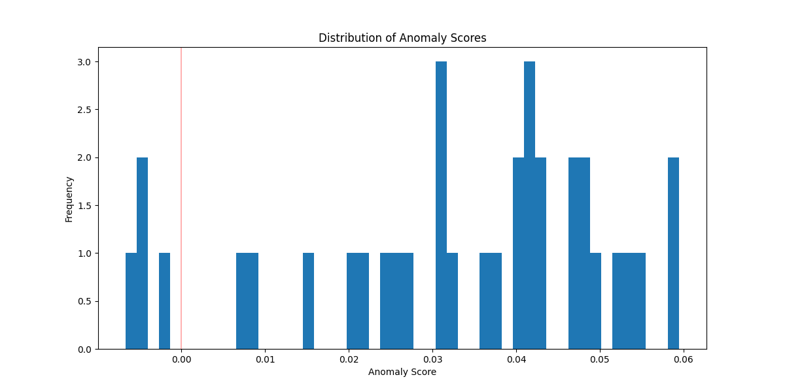
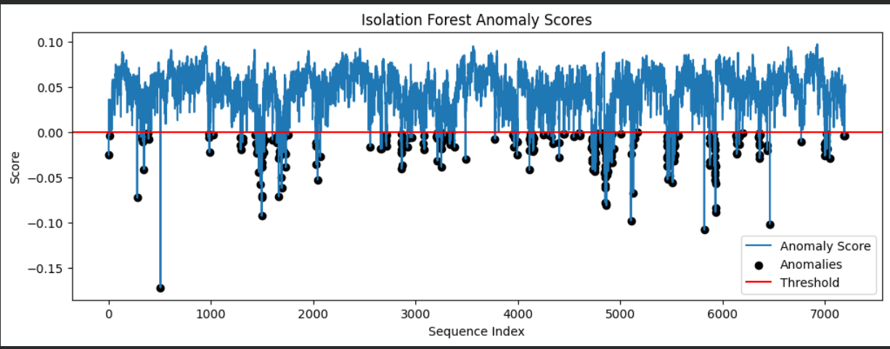
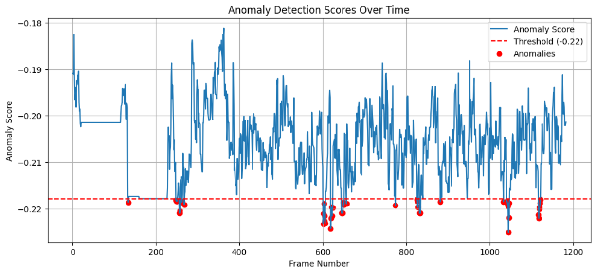

# 🚀 Human Activity Anomaly Detection System

This project implements an **unsupervised anomaly detection system** to identify abnormal human activities using the **Isolation Forest** algorithm combined with **deep feature extraction (ResNet50)**.

---

## 📌 Project Overview

Traditional anomaly detection methods rely on labeled datasets. This project uses an **unsupervised learning approach** to detect anomalies purely based on data patterns.

### 🔑 Key Highlights:

* Uses **ResNet50 (pretrained CNN)** for feature extraction
* Applies **PCA for dimensionality reduction**
* Uses **Isolation Forest** for anomaly detection
* Works without labeled data
* Supports **real-time video anomaly detection**
* End-to-end pipeline from raw video → anomaly prediction

---

## 📸 Results & Output

### 🔹 Anomaly Score Distribution

This graph shows the distribution of anomaly scores.
Values below the threshold are classified as anomalies.



📌 Threshold is computed using the **5th percentile** of anomaly scores.

---

### 🔹 Temporal Anomaly Detection (UCSD Dataset)

Anomaly scores across ~7200 frames from the UCSD dataset.
Black dots represent detected anomalies.



---

### 🔹 Real-Time Video Detection Output

* Total frames processed: **1184**
* Anomalies detected: **53 frames**



---

## 🧠 Approach & Architecture

### System Pipeline:

1. Extract frames from UCSD dataset (video sequences)
2. Convert frames → grayscale → resize (224×224)
3. Extract deep features using **ResNet50**
4. Generate **2048-dimensional feature vectors**
5. Convert frames into **temporal sequences**
6. Apply **PCA (2048 → 500 dimensions)**
7. Train **Isolation Forest**
8. Compute anomaly scores using decision function
9. Apply threshold (5th percentile)
10. Detect and visualize anomalies
11. Save anomalous frames

---

## 📌 Sample Output (Console)

```
Total processed images: 7200
Extracted features shape: (7200, 2048)

Detected anomalies: 360

Classification Report:
              precision    recall  f1-score   support

Anomaly       0.62       0.96      0.75       4186
Normal        0.55       0.07      0.13       2690

Accuracy: 0.61

Confusion Matrix:
[[4030  156]
 [2498  192]]
```

---

## 🧪 Key Observations

* High **recall (0.96)** → model detects most anomalies successfully
* Lower precision due to unsupervised learning nature
* PCA reduces computation significantly while preserving key features
* Model prioritizes anomaly detection over false negatives
* Works effectively on real-time video streams

---

## 📊 Testing & Validation

| Test Type                     | Status | Notes                                |
| ----------------------------- | ------ | ------------------------------------ |
| Feature Extraction (ResNet50) | ✅ Pass | 2048-dim features generated          |
| PCA Dimensionality Reduction  | ✅ Pass | Reduced to 500 components            |
| Isolation Forest Training     | ✅ Pass | Model trained successfully           |
| Anomaly Score Visualization   | ✅ Pass | Graphs generated                     |
| Real-Time Video Detection     | ✅ Pass | Tested on video input                |
| Evaluation Metrics            | ✅ Pass | Accuracy, precision, recall computed |

---

## 📦 Deliverables

* ✅ `isoforest_ucsd_ped1.pkl` – Trained Isolation Forest model
* ✅ `pca_transformer.pkl` – PCA model
* ✅ `features_ucsd_ped1_test.npy` – Extracted features
* ✅ `isoforest_scores.npy` – Anomaly scores
* ✅ `isoforest_anomaly_flags.npy` – Binary anomaly labels
* ✅ Visualization graphs (stored in `/assets`)

---

## 💡 Why This Project Stands Out

* Combines **Deep Learning + Unsupervised ML**
* Works **without labeled data**
* Handles **temporal sequences**, not just images
* Supports **real-time anomaly detection**
* Complete pipeline: raw video → prediction → visualization

---

## 📌 Future Scope

* Improve real-time performance
* Build interactive dashboard for anomaly visualization
* Experiment with Autoencoders and One-Class SVM
* Deploy as REST API for edge/mobile applications

---

## 🛠️ Requirements

Install dependencies using:

```bash
pip install -r requirements.txt
```

### Recommended `requirements.txt`:

```
numpy
matplotlib
scikit-learn
opencv-python
tensorflow
pickle-mixin
```

---

## 📁 Project Structure

```
project/
│── README.md
│── assets/
│     ├── anomaly_distribution.png
│     ├── anomaly_scores_full.png
│     ├── video_detection.png
│── model_train.py
│── detect.py
│── requirements.txt
```

---

## 🎯 Conclusion

This project demonstrates a scalable and practical approach to **unsupervised anomaly detection in human activity data**, combining deep learning feature extraction with classical machine learning for efficient and real-time performance.

---
